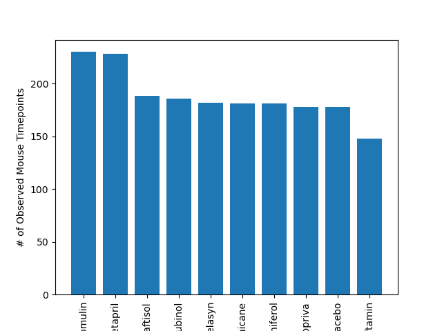
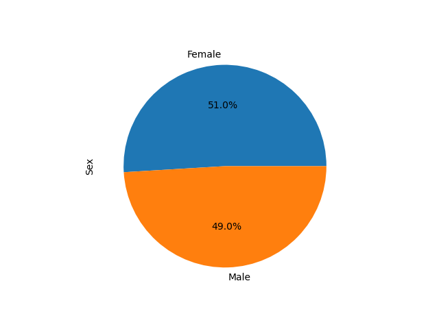
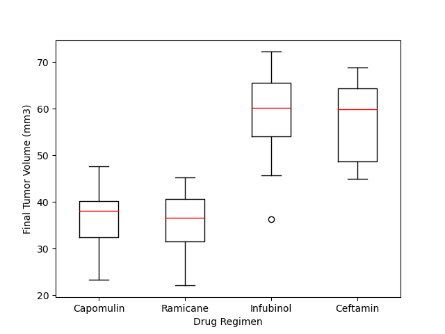
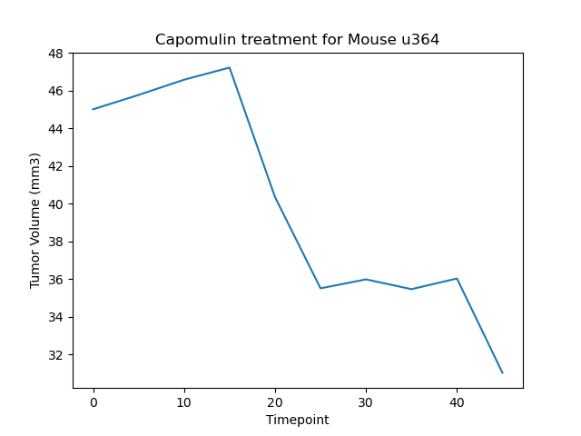
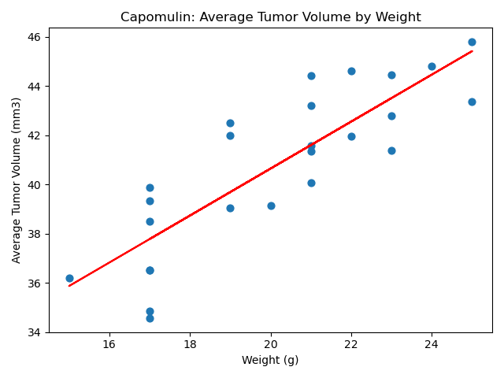

## Tumor Drug Analysis
- All data regarding this analysis can be found in the 'Resources' folder of this repository
- The script used to aggregate the data can be found in the folder labeled 'Pymaceuticals'
- Indivdual images of the data can be found in the 'Images' folder inside 'Pymaceuticals'

## Background - Pymaceuticals, Inc.
I have  just joined Pymaceuticals, Inc., a new pharmaceutical company that specializes in anti-cancer medications. Recently, the company began screening for potential treatments for squamous cell carcinoma (SCC), a commonly occurring form of skin cancer.

In my role as a senior data analyst at the company, I have been given access to the complete data from their most recent animal study. In this study, 249 mice who were identified with SCC tumors received treatment with a range of drug regimens. Over the course of 45 days, tumor development in the mice was observed and measured. The purpose of this study was to compare the performance of Pymaceuticals’ drug of interest, Capomulin, against the other treatment options.

## Analysis

### Drug Regimen Comparison
Comparing all nine drug treatments, along with placebo, shows that Capomulin and Ramicane regimens had a longer survival rate when compared to the other drugs tested.  The remaining drugs had a similar survival rate as compared to placebo, suggesting that they may be ineffective for treating squamous cell carcinoma (SCC).

### Mice Gender Distribution
Additionally, we examined the gender distribution of mice in our study and found a nearly identical balance between male and female mice. Based on this balanced sampling, we assume that gender is not a significant factor influencing the study outcomes.

### Distribution of Tumor Volume 
With Capomulin and Ramicane as the drugs of interest for the company, I examined the distribution of tumor volume in comparison to Infubinol and Ceftamin. Both Capomulin and Ramicane exhibited similar results, showing no outliers. However, a closer look reveals that Capomulin demonstrates more consistent results, as evidenced by closely distributed inner quartile values. Additionally, the distribution of results for Capomulin appears less skewed compared to Ramicane's results. 

### Response Sample for Capomulin
We can look closer at the response individual subject (mouse u364) to Capomulin drug treatment. The tumor volume starts at 45 (mm3) at the beginning of the treatment. It continues to grow for the first 20 days while the drug is administered, but shows significant decrease in volume over the remainder of the treatment.

### Capomulin - Correlation Between Mouse Weight and Average Tumor Volume
There is a strong correlation (.84) between mouse weight and average tumor volume, suggesting that weight of the mouse may impact the effectiveness of Capomulin drug treatment. This should be considered when evaluating the overall efficacy of the drug.

## Conclusion
When comparing all nine drug treatments, along with placebo, the analysis shows that Capomulin and Ramicane had a longer survival rate when compared to the other drugs tested. The remaining drugs had a similar survival rate as compared to placebo, suggesting that they may be ineffective for treating squamous cell carcinoma (SCC). 
 

